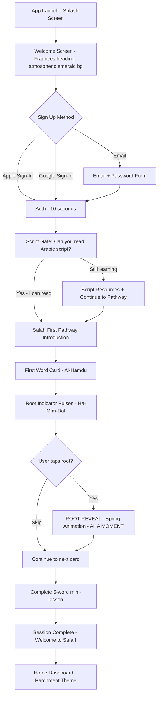
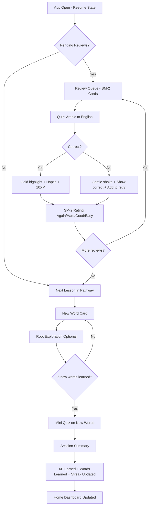
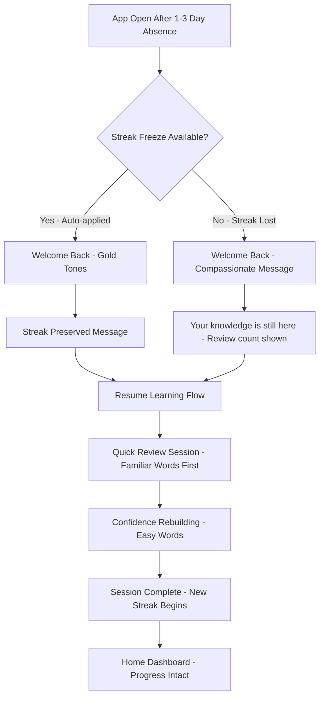
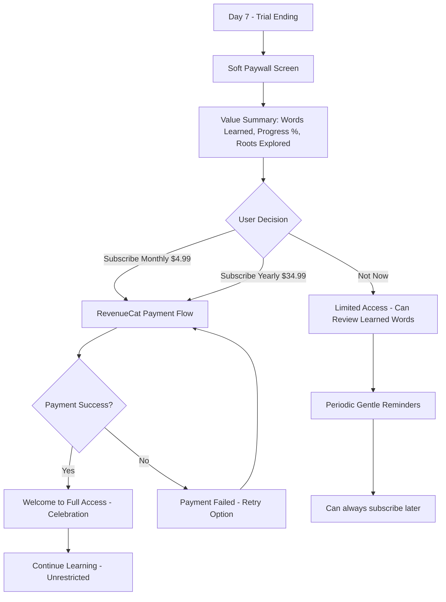

# UX Design Specification safar2-project

**Author:** Emrek
**Date:** 2026-01-30

---

## Executive Summary

### Project Vision

Safar is a mobile-first application that teaches non-Arabic speaking Muslims to understand Quranic Arabic through the root-word system -- revealing how Arabic words derive from 3-letter roots carrying core meaning. The MVP delivers the "Salah First" pathway (~120 words, 6 units), enabling users to understand their daily prayers within 6 weeks.

The core UX promise: transform prayer from recitation into conversation by making the Arabic language's hidden structure visible and learnable in 5-10 minute daily sessions.

### Target Users

**Primary Persona: Fatima (The Devoted Learner)**
- 32, born Muslim, London. Prays 5x daily, reads Arabic phonetically but doesn't understand meaning.
- Learning windows: 10-15 minutes post-Fajr and post-Isha.
- Pain: Spiritual disconnect during prayer. Has tried and abandoned other apps (too much grammar, irrelevant vocabulary, overwhelming scope).
- Success moment: Standing in prayer and *knowing* what she's saying -- not from memorized translation, but from understanding the roots.

**Secondary Persona: James/Yusuf (The Revert)**
- 28, Denver. Converted 2 years ago, learning Arabic script, high motivation, feels behind.
- Needs transliteration support (Phase 2) and accessible entry point.

**User Segmentation:** 60% beginners (know script, zero vocabulary), 30% intermediate (100-300 words), 10% advanced (500+ words).

### Design Philosophy: "Divine Geometry"

The aesthetic direction is **luxury-sacred** -- refined, intentional, and atmospheric. Not generic edtech. Not gamified toy. A space that feels worthy of the content it teaches.

**Guiding Principles (from SKILL.md + Design System):**

1. **Bold thematic commitment** -- Deep Emerald (#0f2e28) and Gold (#cfaa6b) as dominant palette with sharp accents. No timid, evenly-distributed colors. The palette evokes Islamic manuscript tradition: dark backgrounds like night sky, gold like illuminated calligraphy, parchment like aged paper.
2. **Distinctive typography** -- Amiri for Arabic (calligraphic authenticity), Fraunces for headings (editorial elegance), Outfit for UI (clean modernity). Three fonts with clear purpose -- never generic system fonts.
3. **Atmospheric depth** -- Islamic geometric patterns as subtle backgrounds, noise texture overlays, glassmorphism panels, gradient mesh effects, glow shadows. Every screen should feel like entering a space, not viewing a flat page.
4. **High-impact motion** -- Staggered fade-in-up on screen entry, spring animation for root reveal (the memorable moment), celebration Lottie for milestones. Motion is reserved for moments that matter.
5. **The unforgettable thing** -- The root reveal interaction. Arabic words visually branching from their shared root, animated with a spring unfolding. This is what someone screenshots and shares.

### Key Design Challenges

1. **Arabic typography & bidirectionality** -- Proper diacritics (tashkeel) rendering with Amiri font, RTL layout within LTR UI, mixed-direction text handling, and readability at scale (32-48pt Arabic display, 24pt root display, 1.8x line height).
2. **Root explorer "aha moment" delivery** -- The spring-animated reveal of connected words from the same root must feel like revelation, not reference lookup. This is the core product differentiator and the one thing users will remember.
3. **Compassionate engagement mechanics** -- Streaks and gamification in a spiritual learning context must motivate without guilt. The "mercy" (tawbah) freeze system must feel genuinely compassionate, not like a game mechanic wearing religious language.
4. **Micro-session completeness** -- 5-10 minute sessions around prayer times require zero-friction flow. Every session must feel meaningful and complete, even at 3 minutes.
5. **Sacred-to-commercial transition** -- Paywall after 7-day trial for spiritual learning content. The transition must respect the sacred nature of the content while communicating sustainable value.
6. **Dark/Light screen duality** -- Some screens use Midnight/Dark theme (onboarding, lessons, explore), others use Parchment/Light theme (dashboard, profile, settings). Transitions between themes must feel intentional, not jarring.

### Design Opportunities

1. **Prayer-time integration** -- 5x daily natural trigger creates unmatched re-engagement. Post-prayer notification windows feel like natural extensions of worship, not app interruptions.
2. **Progressive comprehension visualization** -- "You now understand 45% of Al-Fatiha" creates a deeply personal, emotionally resonant progress metric tied to daily practice. No competitor offers this.
3. **Root connections as hidden web** -- Revealing the linguistic structure connecting words users have recited for years creates a sense of "the veil lifting" -- the core emotional differentiator.
4. **Atmospheric immersion** -- Using Islamic geometric patterns, glassmorphism, and the luxury-sacred aesthetic creates an environment that feels worthy of Quranic content. This elevates the experience beyond typical edtech apps and positions Safar as a premium, culturally authentic product.

## Core User Experience

### Defining Experience

**Core Loop: Learn -> Discover -> Review -> Recognize**

The fundamental experience is a 5-10 minute micro-session built around vocabulary cards with root exploration:

1. **Learn** -- View word card showing Arabic text (Amiri, 48pt), transliteration, English meaning
2. **Discover** -- Tap the root indicator to reveal connected words (spring animation, the "aha moment")
3. **Review** -- Complete multiple-choice quiz, then rate recall difficulty (4-button SM-2)
4. **Recognize** -- See progress toward understanding prayers you already recite

The core loop is designed to feel like turning pages in a beautiful book -- not clicking through a quiz app. Each card is a moment of discovery, not a task to complete.

**Primary User Action:** Tap root indicator -> See connected words expand with spring animation -> Understand the system behind the word.

This single interaction is the product. Everything else (streaks, XP, quizzes, progress) exists to bring users back to this moment repeatedly.

### Platform Strategy

**Platform:** Cross-platform mobile (React Native / Expo)
- iOS 14.0+ (iPhone and iPad)
- Android 8.0+ (API level 26)
- Touch-first design, portrait orientation primary

**Platform-Specific Considerations:**
- **Touch targets:** 44x44pt minimum (WCAG), critical for Arabic text interaction areas
- **Haptic feedback:** Subtle haptics on correct quiz answers, root tap, and card transitions (iOS Taptic Engine / Android vibration)
- **Audio:** Word pronunciation plays through system audio, ignoring silent mode (educational content exception)
- **Offline:** Core learning loop works without network. Progress queues locally and syncs when connected.
- **Push notifications:** Timed to post-prayer windows (user-configurable). Max 1/day.
- **System font scaling:** Arabic text scales with system accessibility settings (100-200%)
- **Reduce motion:** All spring/fade animations replaced with instant transitions when enabled

**Device Capabilities Leveraged:**
- Secure storage (Keychain/Keystore) for auth tokens
- Local storage (AsyncStorage/MMKV) for progress and sync queue
- Notification scheduling for streak/review reminders

### Effortless Interactions

**Zero-Thought Actions:**

| Interaction | Design Approach |
|-------------|----------------|
| **Resume learning** | App opens directly to "Continue" state -- no navigation required. Home screen shows next lesson or pending reviews. |
| **Card progression** | Swipe left to advance, swipe right to go back. Also tap "Next" button. Gesture + button redundancy. |
| **Audio playback** | Single tap on speaker icon. Audio starts within 500ms. No loading spinner -- preloaded for current + next 3 words. |
| **Root exploration** | Tap root indicator once to expand, tap again to collapse. No modal, no navigation -- inline expansion. |
| **Session completion** | Clear "Session Complete" screen with XP earned, words learned, streak status. One tap to dismiss. |
| **Streak preservation** | Freeze available with single tap + confirmation. No buried settings. |

**Competitor Pain Points Eliminated:**

| Competitor Pain | Safar's Solution |
|----------------|-----------------|
| "Too many words to learn" (overwhelm) | Start with 120 words you already recite. Pathway scoping, not vocabulary dumping. |
| "Words feel disconnected" (isolation) | Root system visually connects every word to a family. |
| "Missed 3 days, lost everything" (guilt) | Mercy freeze + "Welcome back, your knowledge is still here" messaging. Progress persists. |
| "Grammar is scary" (complexity) | Grammar woven naturally through root patterns, not as separate module (Phase 2). |
| "Progress feels invisible" (stagnation) | "You understand X% of Al-Fatiha" -- progress tied to something personally meaningful. |

### Critical Success Moments

**Moment 1: First Root Reveal (Session 1)**
- User sees الْحَمْدُ on a word card
- Taps the root indicator: ح-م-د
- Connected words spring-animate into view: حَمِيد (Praiseworthy), مَحْمُود (Praised), يَحْمَد (to praise)
- User realization: "These aren't random words. They're all connected."
- **Design requirement:** This animation must feel like a flower opening, not a dropdown expanding. Spring damping: 15. Duration: 400ms. Related words fade in with staggered delays (100ms each).

**Moment 2: First Prayer Recognition (Day 3-7)**
- User stands in Dhuhr prayer, recites الْحَمْدُ لِلَّهِ
- For the first time, meaning arrives mid-recitation
- This happens outside the app -- but the app prepared them
- **Design requirement:** Progress screen must connect words to their prayer context. "Words from Al-Fatiha" section on dashboard.

**Moment 3: Streak Survival (Day 5-10)**
- User missed yesterday. Opens app expecting punishment.
- Instead: "Welcome back! Your knowledge is still here. 47 words ready for review."
- No shame. No "you broke your streak" in red. Warm, compassionate tone.
- **Design requirement:** Re-engagement screen uses warm gold (#cfaa6b) tones, not error red. Streak freeze presented as a gift, not an emergency.

**Moment 4: Progress Milestone (Week 2-3)**
- Progress ring on Home screen fills to 45%
- Label: "You understand 45% of Al-Fatiha"
- User realizes this percentage represents something they've recited 50,000+ times
- **Design requirement:** Progress ring uses gold fill on emerald background. Milestone celebrations use Lottie animation -- brief, respectful, not childish.

### Experience Principles

1. **Revelation over instruction** -- Every interaction should feel like discovering something that was always there, not being taught something new. The root system reveals; it doesn't lecture.

2. **Completion over consumption** -- Every session has a clear beginning, middle, and end. Users should close the app feeling "done," not "I should do more." Respect the 5-10 minute window.

3. **Compassion over competition** -- Engagement mechanics serve the learner's spiritual journey, not the app's retention metrics. No guilt. No shame. No "you're falling behind." The mercy freeze isn't a game mechanic -- it's a design value.

4. **Sacred aesthetic, modern interaction** -- The visual design honors the Quranic content (Islamic geometry, manuscript-inspired palette, calligraphic typography) while the interaction design is contemporary mobile (swipe gestures, spring animations, haptic feedback). Tradition in form, innovation in function.

5. **One thing, done brilliantly** -- The root reveal interaction is the product. Streaks, XP, quizzes, and progress all exist to bring users back to the moment of root discovery. If any feature competes with or obscures the root reveal, it's wrong.

---

## Desired Emotional Response

### Primary Emotional Goals

| Emotion | Description | Design Expression |
|---------|-------------|-------------------|
| **Revelation / Wonder** | The "veil lifting" when root connections appear -- users realize Arabic is not a collection of random symbols but an interconnected system of meaning | Spring animation on root reveal, staggered word emergence from the root, gold glow shadow behind the root letters, haptic feedback on reveal initiation |
| **Spiritual Connection** | Feeling closer to prayer and the Quran -- the sense that understanding is deepening a lifelong relationship with the divine text | Islamic geometry background patterns, Amiri calligraphy rendered at hero scale (48-72pt), respectful tone throughout all copy, prayer-context progress metrics |
| **Quiet Confidence** | Growing certainty in understanding -- the shift from "I don't know any Arabic" to "I understand what I'm saying in prayer" | Progress ring filling with gold on emerald, "You understand X% of Al-Fatiha" metric, SM-2 mastery indicators on word cards, review intervals lengthening visibly |
| **Belonging** | Being part of a learning community and a spiritual tradition -- not learning alone, not left behind | Warm welcome-back messaging after absence, compassionate streak handling (mercy freeze), inclusive language that assumes good intent, no "beginner" shaming |
| **Pride in Progress** | Sense of meaningful achievement tied to something personally significant -- not abstract points but prayer comprehension | Milestone Lottie celebrations (brief, respectful), pathway completion markers, words-mastered counter on home dashboard, shareable progress cards |

### Emotional Journey Mapping

**Stage 1: Discovery (Day 1)**
- Emotional arc: Curiosity --> Surprise --> "This is different"
- Trigger: First root reveal animation -- seeing connected words spring from a shared root
- Design support: Onboarding flow keeps friction minimal (3 screens to first content). First word is deeply familiar. Root indicator pulses with gold glow to invite interaction. The spring animation delivers a moment of genuine surprise.
- Risk: User skips root reveal and sees "just another flashcard app." Mitigation: Root indicator pulse animation + contextual tooltip on first encounter.

**Stage 2: Early Learning (Days 2-7)**
- Emotional arc: Engagement --> First prayer recognition --> Emotional breakthrough
- Trigger: Standing in prayer and recognizing a word learned in the app
- Design support: Progress screen explicitly connects words to prayer context ("Words from Al-Fatiha"). Push notifications timed to post-prayer windows reinforce the connection. Dashboard shows prayer comprehension percentage.
- Risk: User doesn't connect app learning to prayer. Mitigation: Prayer-context labels on every word card ("Used in Al-Fatiha, Ayah 2").

**Stage 3: Habit Formation (Days 8-21)**
- Emotional arc: Routine comfort --> Growing confidence --> Streak pride
- Trigger: Streak counter reaching milestones (7 days, 14 days, 21 days)
- Design support: Streak counter prominently displayed. Mercy freeze available without shame. Session length adapts to available reviews. Each session feels complete in 5-10 minutes.
- Risk: Missed day causes guilt spiral and abandonment. Mitigation: Compassionate re-engagement with warm gold tones, no shame language, progress data preserved.

**Stage 4: Deepening (Days 22-42)**
- Emotional arc: Mastery --> Understanding during prayer --> Spiritual fulfillment
- Trigger: Progress ring crossing 50%, then 75% -- user realizes they understand most of Al-Fatiha
- Design support: Milestone celebrations at 25%, 50%, 75%, 100% with Lottie animations. Root connections become richer (more words per root family). SM-2 intervals lengthen, confirming mastery.
- Risk: Content feels repetitive. Mitigation: Root explorer reveals deeper connections, new units unlock with fresh vocabulary, review sessions vary question format.

**Stage 5: Completion (Day 42+)**
- Emotional arc: Achievement --> Desire for more --> Advocacy
- Trigger: Completing the Salah First pathway -- understanding all ~120 words of daily prayer
- Design support: Pathway completion ceremony (full-screen celebration, respectful and dignified). "Share your journey" card for social sharing. Preview of next pathway (Phase 2 content). Review mode keeps knowledge fresh.
- Risk: User churns after completion. Mitigation: Ongoing review sessions maintain engagement, Phase 2 pathway preview creates anticipation.

### Micro-Emotions

**Emotions to Cultivate:**

| Emotion | Trigger Context | Design Mechanism |
|---------|----------------|------------------|
| **Clarity** | Every screen, every interaction | Clear visual hierarchy, single primary action per screen, consistent layout patterns, generous whitespace |
| **Trust** | Consistent, predictable behavior | Reliable navigation, predictable animation timing, honest progress metrics, no dark patterns |
| **Delight** | Root reveals, correct answers, milestones | Spring animations, gold glow effects, haptic feedback, brief Lottie celebrations |
| **Accomplishment** | Session completion, quiz mastery | Session summary with stats, XP animation, streak update, "Session Complete" confirmation |
| **Safety** | Mistakes, missed days, returning after absence | No judgment copy, warm color palette for errors, mercy freeze as gift, progress preservation |
| **Curiosity** | Root connections teasing more words | "3 more words from this root" badges, related word previews, root family count indicators |
| **Flow** | During 5-10 minute learning sessions | Seamless card transitions, preloaded audio, no loading spinners, session timer as gentle guide not pressure |

**Emotions to Prevent:**

| Emotion | Trigger to Avoid | Prevention Strategy |
|---------|------------------|---------------------|
| **Shame** | Missed streaks, wrong answers, slow progress | No red alerts for streaks, constructive error messaging, progress always framed positively |
| **Overwhelm** | Too many words, complex UI, information density | 120-word scoped pathway, single-column layout, progressive disclosure, generous negative space |
| **Anxiety** | Countdown timers, performance pressure, loss aversion | No timed quizzes, no hearts/lives system, no "you'll lose access" messaging, gentle session pacing |
| **Frustration** | Unclear navigation, unexpected behavior, bugs | Consistent navigation patterns, predictable animations, offline capability, error recovery always one tap |
| **Guilt** | Missed days, incomplete sessions, slow learning | Mercy freeze as compassionate gift, partial sessions count, "your pace is perfect" messaging |
| **Boredom** | Repetitive quiz formats, predictable interactions | Varied question types, root reveals add discovery, spaced repetition varies review timing |
| **Isolation** | Learning alone, no community, no support | Warm personalized messaging, future community features (Phase 3), supportive notification tone |

### Design Implications

| Emotion | UX Approach |
|---------|-------------|
| **Revelation** | Spring animation with damping:15 and stiffness:100 on root reveal. Gold glow shadow (shadow-[0_0_30px_rgba(207,170,107,0.3)]) pulses behind root letters. Related words use staggered fade-in-up (100ms delay each) creating an organic unfolding effect. |
| **Spiritual Connection** | Islamic geometric SVG patterns as subtle background layers (opacity 5-10%). Amiri font at display scale (48-72pt) for Arabic text. Midnight (#0a1f1b) and deep emerald (#0f2e28) backgrounds for learning screens. Noise texture overlay adds manuscript-like depth. |
| **Quiet Confidence** | Progress rings with animated gold fill on emerald track. Mastery badges use the rotated-square (diamond) motif from the design system. Clear level indicators show progression through pathway units. SM-2 intervals displayed as "Next review: 3 days" confirming growing mastery. |
| **Belonging** | Warm re-engagement copy: "Welcome back -- your knowledge is still here." Mercy freeze presented as gift: "We saved your streak." Compassionate notification tone: "Your daily words are waiting." No comparative language or competitive framing. |
| **Pride** | Lottie milestone celebrations at key thresholds (25%, 50%, 75%, 100%). Pathway completion ceremony uses full-screen animation (dignified, 3-4 seconds). Shareable progress cards with beautiful typography for social media. Words-mastered counter animates up on home screen. |
| **Curiosity** | "Words from same root" teasers appear on word cards with count badge (e.g., "+3 related words"). Root family count badges on the root indicator invite exploration. "Explore more roots" CTA appears after completing a lesson unit. Root explorer screen (Phase 2) teased in navigation. |

### Emotional Design Principles

1. **Every screen transition should feel like turning a page in a sacred manuscript, not clicking through an interface.** Cross-fades between screens (300ms), slide-up for new contexts, spring physics on interactive elements. The app has rhythm and breath -- never jarring cuts.

2. **Error states use warm gold tones and compassionate language -- never red alerts or shame-based copy.** Wrong quiz answers show amber highlight with "Not quite -- the answer is..." Missed streaks show gold warmth with "Welcome back." Form validation uses rose-muted, never harsh red.

3. **Progress visualization connects to personally meaningful metrics -- prayer comprehension, not abstract XP.** The primary progress metric is "% of Al-Fatiha understood." XP exists as secondary reinforcement but never as the headline. Every number on screen connects to something the user cares about spiritually.

4. **Silence and negative space are emotional tools -- the app should breathe, not overwhelm.** Generous padding (p-6 minimum page level). Single-column layout. One primary action per screen. The luxury-sacred aesthetic requires restraint -- empty space communicates confidence and respect for the content.

5. **Celebration is brief, respectful, and tied to spiritual significance -- not childish gamification.** Lottie celebrations last 2-4 seconds maximum. No confetti cannons, no cartoon characters, no sound effects that trivialize the content. Milestone messaging references the spiritual journey: "You now understand the opening prayer."

---

## UX Pattern Analysis & Inspiration

### Inspiring Products Analysis

**1. Duolingo (Language Learning Leader)**

- **Strengths:** Brilliant gamification loop that drives daily engagement. Streak mechanic is the gold standard for habit formation. Bite-sized lessons (3-5 minutes) respect user time. Progress visualization (tree/path) creates clear learning journey. Character-driven engagement (Duo the owl) adds personality. Bottom navigation with clear hierarchy.
- **UX Patterns to Adopt:** Session-based learning structure with clear start/end. Streak counter with visual prominence on home screen. XP as secondary reward metric reinforcing behavior. Bottom navigation with 4-5 tabs as primary navigation pattern. Progress path showing journey through content units.
- **What to Avoid:** Excessive gamification -- hearts/lives system that punishes practice is antithetical to Safar's compassion principle. Aggressive streak loss messaging creates guilt. Childish tone and cartoon aesthetic inappropriate for sacred Quranic content. Notification spam (multiple daily notifications). Leaderboards that create anxiety rather than motivation.

**2. Quran.com (Quranic Content Standard)**

- **Strengths:** Beautiful Arabic text rendering with proper Uthmani script and tashkeel. Verse-by-verse audio with multiple reciters. Clean, focused reading experience. Proper RTL handling. Trusted within the Muslim community for Quranic content accuracy.
- **UX Patterns to Adopt:** Arabic typography excellence -- proper diacritics rendering, appropriate font sizing, correct RTL layout. Audio integration pattern for pronunciation playback. Verse/surah navigation patterns familiar to target users. Content accuracy standards for Quranic vocabulary.
- **What to Avoid:** Read-only passive experience -- no learning loop, no spaced repetition, no active recall. Feature density on screens creates cognitive overload. No personalized learning path. Utility-focused design lacks emotional engagement.

**3. Headspace (Spiritual/Wellness UX)**

- **Strengths:** Calming aesthetic direction that creates an emotional environment. Session-based structure with clear beginning, middle, and end. Progress without pressure -- no guilt for missed days. Beautiful illustrations and animations that feel premium. Gentle onboarding that doesn't overwhelm. Premium positioning that justifies subscription.
- **UX Patterns to Adopt:** Calm aesthetic tone appropriate for spiritual content. Session completion feeling -- users close the app feeling "done," not "I should do more." Gentle streak handling -- missed days acknowledged without punishment. Premium feel without complexity -- luxury through restraint. Breathing room in layout and pacing.
- **What to Avoid:** Over-illustration that becomes decorative filler. Subscription nag screens that interrupt the experience. Content library overwhelm (too many options, not enough guidance). Passive listening is not active learning -- Safar needs recall mechanics.

**4. Drops (Visual Language Learning)**

- **Strengths:** Stunning visual design that stands apart from every other language app. 5-minute session model that respects time constraints. Swipe-based card interactions that feel natural and fluid. Beautiful micro-animations on every interaction. Distinctive non-generic aesthetic -- immediately recognizable brand.
- **UX Patterns to Adopt:** Time-limited sessions that feel complete (5-minute model aligns with Safar's micro-session design). Swipe card mechanics for vocabulary progression. Visual word associations that aid memory. Bold, distinctive design that refuses generic edtech aesthetics.
- **What to Avoid:** Limited free access (5 minutes/day) feels punitive and creates frustration. Some interactions are too gimmicky -- form over function. Limited depth -- visual association without root system understanding. No spaced repetition means shallow retention.

### Transferable UX Patterns

**Navigation:**
- Bottom tab bar with 4-5 items (Duolingo pattern, universally understood)
- Floating pill-style navigation bar (Divine Geometry design system -- midnight glassmorphism)
- Back arrow (top-left) for stack navigation within sections
- Modal slide-up for overlays and detail views

**Learning:**
- Card-based vocabulary presentation (Drops-inspired, adapted for Arabic with root indicator)
- Session timer as gentle progress indicator, not countdown pressure (Headspace-inspired)
- Active recall through multiple-choice quiz (proven learning science pattern)
- SM-2 self-rating for spaced repetition scheduling (Anki-proven, Safar-styled)

**Engagement:**
- Streak counter with visual prominence on home screen (Duolingo-proven)
- Progress rings tied to personally meaningful goals (custom -- prayer comprehension %)
- XP as secondary reinforcement metric (Duolingo-inspired, de-emphasized)
- Milestone celebrations at meaningful thresholds (custom -- pathway percentages)

**Feedback:**
- Haptic + visual confirmation on correct answers (iOS/Android native pattern)
- Gentle shake + warm messaging on incorrect answers (custom -- compassionate)
- Gold highlight for success states (Divine Geometry palette)
- Amber/warm tones for "needs attention" states (never harsh red)

**Onboarding:**
- Progressive disclosure -- reveal complexity gradually (Headspace-inspired)
- Script gate as single qualifying question (custom -- scopes learning path)
- First content within 2 minutes of install (Duolingo speed benchmark)
- Root reveal as "aha moment" in first session (custom -- product-defining)

### Anti-Patterns to Avoid

- **Guilt-based retention:** Duolingo's aggressive streak loss messaging ("You're about to lose your streak!") directly contradicts Safar's compassion principle. Streaks motivate; streak loss never punishes.
- **Overwhelming choice paralysis:** Presenting too many pathways, units, or options upfront. Safar MVP has one pathway (Salah First). Simplicity is a feature.
- **Generic edtech aesthetics:** White backgrounds, purple gradients, Inter/SF Pro font, rounded-everything sameness. Safar's Divine Geometry palette must be unmistakably distinct.
- **Separate grammar/vocabulary silos:** Traditional Arabic apps teach grammar and vocabulary as disconnected modules. Safar weaves grammatical understanding through root patterns naturally.
- **Read-only Quran display without learning loop:** Displaying Arabic text without active recall, spaced repetition, or progressive learning. Beautiful text alone does not teach.
- **Hearts/lives limiting practice:** Any system that punishes effort or limits how much a user can learn. Users should never be told "come back later" when they want to study.
- **Notification spam:** More than 1 push notification per day. Post-prayer windows are sacred -- one gentle reminder is a service; multiple notifications are harassment.
- **Dark patterns in subscription:** Countdown timers, "last chance" urgency, hiding the close button, making cancellation difficult. The sacred-to-commercial transition must be honest and respectful.

### Design Inspiration Strategy

**Adopt (Use directly):**
- Session-based micro-learning with clear start/end (Duolingo + Drops)
- Streak visualization with visual prominence (Duolingo)
- Progress rings as primary progress indicator (custom implementation)
- Card-swipe interactions for vocabulary progression (Drops)
- Bottom navigation as primary navigation (industry standard)
- Haptic feedback for interactive moments (platform native)

**Adapt (Modify for Safar's context):**
- Duolingo gamification: Strip guilt mechanics, keep progress visualization and streak motivation. Replace competitive elements with personal spiritual journey framing.
- Headspace calm: Keep the breathing room and session completeness. Add discovery excitement through root reveals -- Safar should be calm AND surprising.
- Drops boldness: Apply the "refuse to be generic" philosophy to Islamic aesthetic rather than Drops' illustration style. Bold through cultural authenticity, not graphic design trends.
- Quran.com typography: Adopt Arabic rendering excellence. Embed it within an active learning experience rather than passive reading.

**Avoid (Reject entirely):**
- Generic edtech templates and design systems
- Punishment mechanics of any kind
- Notification abuse and engagement dark patterns
- Overwhelming content libraries without guided paths
- Childish gamification (cartoon characters, sound effects, confetti excess)
- Fear-based subscription messaging
- Information-dense screens without visual hierarchy

---

## Design System Foundation

### Design System Choice

**Custom Design System via NativeWind v4**

The project uses a fully custom design system ("Divine Geometry") implemented through NativeWind v4 (Tailwind CSS for React Native). This was chosen because:

- The luxury-sacred aesthetic cannot be achieved with Material Design, Ant Design, or other established systems
- NativeWind provides utility-first styling with full customization through tailwind.config.js
- The design system has already been extracted from a working prototype (prototype.jsx)
- Custom design tokens (colors, typography, spacing, animations) are defined and documented

### Rationale for Selection

1. **Aesthetic Uniqueness** -- The Divine Geometry palette (Deep Emerald, Midnight, Parchment, Gold, Cream) and triple-font typography stack (Amiri, Fraunces, Outfit) are not achievable with stock design systems. Material Design's color system, Ant Design's token structure, and similar frameworks impose aesthetic constraints that would dilute the luxury-sacred identity.

2. **Prototype Fidelity** -- Design tokens are already extracted from a working prototype (prototype.jsx), ensuring design-to-code accuracy. The tailwind.config.js file maps directly to the prototype's visual output, eliminating the translation gap between design and implementation.

3. **Team Velocity** -- NativeWind's utility classes enable rapid iteration without switching between style files. Developers can see and modify styling inline, reducing context-switching. The Tailwind mental model (constraint-based design) prevents one-off values that break consistency.

4. **Performance** -- NativeWind v4 compiles to optimized StyleSheet objects at build time, avoiding runtime style calculation overhead. This is critical for smooth animations (root reveal spring, card transitions) where frame drops would break the luxury feel.

5. **Consistency** -- Tailwind's constraint-based design enforces the design system by making it easier to use tokens than to use custom values. The spacing scale (4px base), color palette, and typography scale are defined once in config and applied everywhere through class names.

### Implementation Approach

- **tailwind.config.js** defines all design tokens: colors (emerald-deep, midnight, parchment, gold, cream + opacity variants), fonts (amiri, fraunces, outfit), spacing (4px base scale), animations (fade-in-up, pulse-slow, shake), and shadows (glow, card, soft)
- **NativeWind v4 className** prop applied to all React Native components, enabling Tailwind utility classes
- **Custom component library** built on design tokens -- not wrapping a third-party library. Each component (WordCard, RootRevealPanel, QuizCard, etc.) is built from primitives styled with NativeWind
- **Reanimated v3** for complex animations that exceed CSS capabilities: root reveal spring physics (damping: 15, stiffness: 100), card swipe gestures with spring return, progress ring animated fill
- **Lottie** for milestone celebrations and pathway completion ceremonies -- pre-designed animation files played at key moments
- **expo-google-fonts** for loading Amiri, Fraunces, and Outfit with specific weight variants

### Customization Strategy

**Colors:**
All colors defined as semantic tokens in tailwind.config.js:
- `emerald-deep`: #0f2e28 (primary brand, text on light)
- `midnight`: #0a1f1b (dark backgrounds)
- `parchment`: #f4f1ea (light backgrounds)
- `gold`: #cfaa6b (accent, CTAs, highlights)
- `cream`: #e8dcc5 (text on dark)
- Opacity variants: white/5, white/10, gold/10, gold/20, gold/30

**Typography:**
Font families registered via Expo font loading:
- `font-amiri`: Amiri (Arabic display)
- `font-fraunces`: Fraunces (headings)
- `font-outfit`: Outfit (UI/body)
Scale defined with clear hierarchy from arabic-hero (72px) through label-small (10px)

**Spacing:**
Follows Tailwind's 4px base unit scale. Custom additions for app-specific needs (e.g., bottom navigation offset, card padding standards). Page-level padding standardized at p-6 (24px) with p-8 (32px) for hero areas.

**Custom Keyframes:**
App-specific animations defined in Tailwind config:
- `fade-in-up`: translateY(10px) + opacity 0 --> translateY(0) + opacity 1 (0.8s)
- `pulse-slow`: opacity 1 --> 0.85 --> 1 (3s loop) -- used for root indicator attention
- `shake`: translateX(0, -4px, 4px, -4px, 0) (0.4s) -- used for incorrect answers

**Component Variants:**
NativeWind's variant system used for theme-aware components:
- Buttons: primary (gold), secondary (cream), tertiary (text-only), destructive (rose-muted)
- Cards: dark-theme (midnight bg, cream text), light-theme (parchment bg, emerald text)
- Text: automatically adapts color based on theme context

---

## Defining Core Experience

### The Defining Interaction: Root Reveal

"Tap a word. See its family." -- This is Safar's Tinder swipe, its Instagram filter. The single interaction that defines the product and differentiates it from every other Arabic learning app.

Every design decision, every screen layout, every animation timing serves this moment. If a feature competes with or distracts from the root reveal, it is wrong and must be removed or redesigned.

### User Mental Model

- **Current state:** Users see Arabic words as isolated symbols -- sounds they've memorized phonetically without structural understanding. Each word is an island. Learning Arabic means memorizing thousands of disconnected vocabulary items.

- **Safar's new model:** Arabic is a connected system where 3-letter roots generate families of related words. The root carries core meaning, and derived words are variations on that meaning. This is not a teaching invention -- it is how Arabic actually works.

- **The root reveal makes the invisible structure visible** -- literally showing the connections between words users have recited for years without understanding. The animation (spring physics, staggered emergence) embodies the metaphor of something hidden becoming visible.

- **Mental shift:** From "I need to memorize 120 individual words" to "I'm learning roughly 40 root families that unlock 120+ words." This reframing reduces perceived difficulty while increasing perceived value. Each root learned is a multiplier, not an addition.

### Success Criteria for Root Reveal

| Criterion | Target | Measurement |
|-----------|--------|-------------|
| **Comprehension** | User understands root-to-word connection after first encounter | Root tap-through rate >= 40% in first 3 sessions |
| **Delight** | Interaction feels like discovery, not reference lookup | Session completion rate >= 80% for sessions containing root reveals |
| **Retention** | Users return to discover more roots | D1 retention >= 60% for users who tapped a root on Day 1 |
| **Sharing** | Experience is screenshot-worthy and shareable | Organic share rate tracked in Phase 2 measurement |
| **Learning** | Root connections improve vocabulary retention | Words with explored roots show higher SM-2 recall scores |

### Novel UX Patterns

The root reveal combines familiar and novel patterns:

- **Familiar:** Card-based vocabulary display (Drops, Anki), tap to expand (accordion pattern), spring physics on interaction (iOS system animations)
- **Novel:** Spring-animated word family tree emerging from a 3-letter root, with each related word appearing on staggered delays -- creating a sense of organic growth rather than mechanical expansion
- **Metaphor:** A seed (3-letter root) growing into a tree (word family). This botanical metaphor informed the app name "Safar" (journey) and drives the animation design. The spring physics feel organic -- like growth, not like a dropdown menu opening.

### Experience Mechanics -- Root Reveal Sequence

**1. Initiation:**
User sees a word card with Arabic text (Amiri, 48pt) centered on the card. Below the word, a small root indicator shows 3 Arabic letters separated by dashes (e.g., ح-م-د). The indicator has a subtle gold border (border-gold/30) and pulse-slow animation to attract attention without demanding it. On first encounter, a brief tooltip appears: "Tap to see the word family."

**2. Interaction:**
User taps the root indicator.
- Root indicator expands to a full-width panel with spring physics (damping: 15, stiffness: 100)
- Background shifts from card color to midnight (#0a1f1b) with noise texture overlay for depth
- 3-letter root displays large (Amiri, 36pt) at the top of the panel in gold (#cfaa6b)
- Spring animation reveals connected words, each emerging below the root
- Each related word appears on 100ms staggered delay with fade-in-up animation
- Words display: Arabic (Amiri, 24pt) + transliteration (Outfit, 14pt, muted) + English meaning (Outfit, 16pt)
- Haptic feedback fires on root tap (light impact -- iOS Taptic Engine / Android vibration)
- Total animation duration: approximately 400ms for root + 100ms per related word

**3. Feedback:**
- Gold glow shadow (shadow-[0_0_30px_rgba(207,170,107,0.3)]) pulses once behind the root letters
- Word count badge appears: "3 words from this root" in label-uppercase style (Outfit, 12px, tracking-widest)
- Each related word is individually tappable -- tapping navigates to that word's full card in the lesson
- A subtle line connects each related word back to the root visually (gold, 1px, opacity 30%)

**4. Completion:**
User taps the root area again OR swipes to the next card. Panel collapses with reverse spring animation (faster than open -- 250ms). A small checkmark appears on the root indicator (gold, fade-in, 200ms) showing the user has explored this root. The checkmark persists across sessions -- returning to this word card shows the root as "explored."

### Experience Mechanics -- Quiz Sequence

**1. Initiation:**
After learning 5 new words in a lesson, the quiz screen slides up (fade-in-up, 0.8s). Header: "Quick Review" (Fraunces, heading-sm). Subtext: "Let's see what stuck" (Outfit, body-sm, muted).

**2. Question Presentation:**
Arabic word displayed large (Amiri, 48pt) centered at top of screen. Four English answer options arranged vertically below (Outfit, 16pt, each in a rounded-xl button with padding-4). Options fade in with 50ms stagger for visual rhythm.

**3. Correct Answer:**
- Selected option highlights with gold border and subtle emerald background pulse
- Haptic success feedback (medium impact)
- "+10 XP" text animates up from the button and fades out (gold, 300ms)
- Brief pause (500ms) before advancing to SM-2 rating

**4. Incorrect Answer:**
- Selected option does gentle shake animation (0.4s, translateX: 0, -4px, 4px, -4px, 0)
- Haptic warning feedback (light impact)
- Correct answer highlights with gold border (not green -- gold is the universal positive color)
- Warm message appears: "Not quite -- [correct word] means [correct meaning]"
- Word automatically added to review queue with short interval
- Brief pause (800ms) before advancing to SM-2 rating

**5. SM-2 Rating:**
After each quiz question, 4 difficulty rating buttons appear in a horizontal row:
- **Again** (rose-muted background) -- "I didn't remember"
- **Hard** (amber background) -- "That was tough"
- **Good** (emerald-muted background) -- "I got it"
- **Easy** (gold background) -- "Too easy!"
Each button is 25% width, 48px height, rounded-xl. Single tap with haptic feedback. Rating immediately schedules the next review interval via SM-2 algorithm.

**6. Session Completion:**
Quiz summary slides up showing: accuracy percentage (Fraunces, heading-lg), words reviewed count, XP earned, next review date preview. "Done" primary CTA button returns to home dashboard.

---

## Visual Design Foundation

### Color System

Safar uses the "Divine Geometry" palette -- a luxury-sacred color system inspired by Islamic manuscript illumination. The palette evokes the aesthetic of hand-illuminated Qurans: midnight-dark backgrounds like the night sky, gold accents like gilded calligraphy, and parchment tones like aged vellum.

**Primary Palette:**

| Token | Hex | Usage |
|-------|-----|-------|
| Deep Emerald | #0f2e28 | Primary brand color, text on light backgrounds, card backgrounds on dark theme |
| Midnight | #0a1f1b | Dark screen backgrounds (lessons, onboarding, explore), overlays, navigation bar |
| Parchment | #f4f1ea | Light screen backgrounds (dashboard, profile, settings), light-theme cards |
| Gold | #cfaa6b | Primary accent, CTA buttons, highlights, active states, progress fills, root display |
| Cream | #e8dcc5 | Primary text on dark backgrounds, secondary accents on light backgrounds |

**Extended Palette:**

| Token | Value | Usage |
|-------|-------|-------|
| White 5% | rgba(255,255,255,0.05) | Subtle borders on dark backgrounds, separator lines |
| White 10% | rgba(255,255,255,0.10) | Input field backgrounds on dark theme, inactive track fills |
| Gold 10% | rgba(207,170,107,0.10) | Root indicator background, subtle highlight areas |
| Gold 20% | rgba(207,170,107,0.20) | Active highlight backgrounds, selected states |
| Gold 30% | rgba(207,170,107,0.30) | Active state backgrounds, focus indicators, glow shadows |

**Semantic Color Mapping:**

| Semantic Role | Color | Usage |
|---------------|-------|-------|
| Primary | Gold (#cfaa6b) | CTAs, active navigation, progress fills, root display, positive indicators |
| Background Light | Parchment (#f4f1ea) | Dashboard, profile, settings, light-theme screens |
| Background Dark | Midnight (#0a1f1b) | Lessons, onboarding, explore, dark-theme screens |
| Text Primary Light | Deep Emerald (#0f2e28) | Body text, headings, labels on light (parchment) screens |
| Text Primary Dark | Cream (#e8dcc5) | Body text, headings, labels on dark (midnight) screens |
| Success | Emerald (muted) | Correct answers, completed states, mastery indicators |
| Warning | Amber (warm) | Streak at risk, review overdue, attention needed |
| Error | Rose (muted, never harsh red) | Incorrect answers, form validation errors, destructive actions |

**Screen Theme Assignment:**

| Theme | Screens | Rationale |
|-------|---------|-----------|
| Dark (Midnight) | Onboarding, Splash, Lessons, Explore/Root Garden, Frequency Lessons | Immersive learning environments -- "entering the study." Dark backgrounds create focus and atmospheric depth. |
| Light (Parchment) | Dashboard/Home, Profile, Settings, Word Analysis | Functional utility spaces -- "looking at your progress." Light backgrounds optimize readability for data-heavy screens. |

**Contrast Compliance (WCAG):**

| Combination | Ratio | Rating |
|-------------|-------|--------|
| Cream (#e8dcc5) on Midnight (#0a1f1b) | 12.5:1 | AAA |
| Deep Emerald (#0f2e28) on Parchment (#f4f1ea) | 10.2:1 | AAA |
| Gold (#cfaa6b) on Midnight (#0a1f1b) | 6.8:1 | AA |
| Gold (#cfaa6b) on Deep Emerald (#0f2e28) | 5.1:1 | AA |

All primary text combinations exceed WCAG AA requirements. The Gold-on-dark combinations meet AA for normal text and AAA for large text (18pt+), which is how gold is primarily used (headings, CTAs, Arabic display).

### Typography System

**Font Stack:**

| Font | Purpose | Weight Range | Google Fonts Specification |
|------|---------|-------------|---------------------------|
| Amiri | Arabic text, calligraphic display | 400, 700 | Amiri:ital,wght@0,400;0,700;1,400 |
| Fraunces | Headings, editorial elements | 300, 400, 600 | Fraunces:opsz,wght@9..144,300;9..144,400;9..144,600 |
| Outfit | UI elements, body text, labels | 300, 400, 500, 700 | Outfit:wght@300;400;500;700 |

**Rationale:**
- **Amiri** provides calligraphic authenticity for Arabic text. It renders tashkeel (diacritical marks) correctly at all sizes and carries the visual weight of traditional Quranic manuscripts.
- **Fraunces** is an editorial serif with optical sizing. Its elegance and variable weight range support the luxury positioning while remaining highly legible for headings.
- **Outfit** is a clean geometric sans-serif that provides excellent readability for UI elements, body text, and labels. Its modern simplicity contrasts effectively with Amiri and Fraunces.

**Type Scale:**

*Arabic Display (Amiri):*
- `arabic-hero`: 72px -- Splash screen title, major celebrations
- `arabic-large`: 48px -- Word cards (primary learning display), quiz questions
- `arabic-medium`: 36px -- Inline words, root display in reveal panel
- `arabic-small`: 24px -- Related words in root reveal, secondary Arabic text

*Headings (Fraunces):*
- `heading-xl`: 48px, weight 600 -- Screen titles (rare, high-impact)
- `heading-lg`: 36px, weight 600 -- Section headers, milestone numbers
- `heading-md`: 30px, weight 400 -- Card titles, progress percentages
- `heading-sm`: 24px, weight 400 -- Subsection headers, streak count
- `heading-xs`: 20px/18px, weight 400 -- Minor headers, button text

*Body (Outfit):*
- `body-lg`: 20px, weight 300 -- Feature descriptions, onboarding text
- `body-md`: 18px, weight 400 -- Primary body text, word meanings
- `body-sm`: 14px, weight 400 -- Secondary text, transliterations, captions
- `body-xs`: 12px, weight 400 -- Metadata, timestamps, fine print

*Labels (Outfit):*
- `label-uppercase`: 12px, uppercase, tracking-widest -- Category labels, badges, section dividers
- `label-small`: 10px, uppercase, tracking-widest -- Fine labels, word count indicators

**Line Heights:**
- Arabic: 1.8x (accommodates diacritics/tashkeel above and below baseline)
- Headings: 1.2x (tight for visual impact)
- Body: 1.5x (comfortable reading)
- Labels: 1.0x (compact for badges and indicators)

### Spacing & Layout Foundation

**Base Unit:** 4px (Tailwind default)

**Spacing Scale:**

| Token | Value | Usage |
|-------|-------|-------|
| space-1 | 4px | Tight gaps (icon + label, inline elements) |
| space-2 | 8px | Component internal padding (badge padding, tight card elements) |
| space-3 | 12px | Related element gaps (label + input, heading + body) |
| space-4 | 16px | Standard component gap (between cards, list items) |
| space-5 | 20px | Section separation (within a card or panel) |
| space-6 | 24px | Page padding (screen edges), card padding (standard) |
| space-8 | 32px | Major section breaks (between distinct content areas) |
| space-10 | 40px | Large content padding (hero areas, celebration screens) |
| space-12 | 48px | Screen section separation (between major sections) |
| space-16 | 64px | Major layout breaks (top/bottom screen padding with nav) |

**Border Radius Scale:**

| Token | Value | Usage |
|-------|-------|-------|
| rounded-lg | 8px | Small elements, badges, inline chips |
| rounded-xl | 12px | Buttons, input fields, quiz option cards |
| rounded-2xl | 16px | Standard cards, panels, modal corners |
| rounded-3xl | 24px | Large cards, content panels, session summary |
| rounded-[2rem] | 32px | Pathway cards, hero elements, onboarding cards |
| rounded-full | 9999px | Circles (avatars, icon buttons), pills (nav bar, tags) |

**Layout Principles:**

1. **Single-column layout** for mobile (portrait-first). No multi-column grids in MVP.
2. **Content breathes** -- generous padding at all levels. p-6 (24px) at page level, p-8 (32px) for hero areas. Negative space is an active design choice, not wasted space.
3. **Cards float** with shadow and rounded corners -- never flat rectangles against flat backgrounds. Shadow creates depth hierarchy.
4. **Navigation bar floats** at bottom of screen (fixed position, bottom-8 offset, rounded-2xl, glassmorphism backdrop-blur). Not attached to screen edge.
5. **Decorative blur orbs and geometric patterns** in backgrounds create atmospheric depth. Positioned with absolute positioning, low opacity (5-10%), never interfering with content readability.
6. **Content max-width: 428px** (iPhone 14 Pro Max width as design target). Content centers on wider devices.

### Accessibility Considerations

- **Color contrast:** All primary text combinations meet WCAG AA (4.5:1 for normal text, 3:1 for large text). Gold on dark backgrounds exceeds AA for all Arabic display sizes (24pt+).
- **Arabic typography:** Minimum 24px with 1.8x line height to accommodate diacritical marks (tashkeel) above and below the baseline. Amiri font verified for correct rendering at all scale points.
- **Touch targets:** Minimum 44x44pt for all interactive elements, with additional padding on Arabic text interaction areas (root indicator, audio button).
- **System font scaling:** All text respects system accessibility settings (100-200% scaling). Layout reflows gracefully at maximum scale.
- **Reduce motion:** All spring animations, fade-in-up transitions, pulse effects, and Lottie celebrations are replaced with instant state changes when the system reduce-motion preference is enabled.
- **Screen reader labels:** All interactive elements carry accessibilityLabel and accessibilityRole. Arabic text includes pronunciation hints.
- **Focus indicators:** Visible gold outline (2px) on all focusable elements when using keyboard or switch access.

---

## Design Direction Decision

### Design Directions Explored

Six design direction variations were explored for Safar, each emphasizing different aspects of the luxury-sacred aesthetic:

1. **Midnight Scholar** -- Full dark theme across all screens. Emerald gradients as primary backgrounds. Gold accents on every interactive element. Dense information layout with Islamic geometric borders. Feels like a luxury digital manuscript. Risk: visual fatigue on data-heavy screens (dashboard, progress).

2. **Parchment Pages** -- Primarily light theme with warm parchment backgrounds throughout. Cards float with subtle shadows on textured paper backgrounds. Feels like an illuminated book. Risk: learning screens lack the immersive depth needed for focused study.

3. **Dual-World** -- Dark theme for learning/immersive screens, light theme for utility/progress screens. Transitions between worlds are intentional and meaningful -- entering dark for study, returning to light for reflection. Risk: theme transitions must be carefully managed to avoid jarring shifts.

4. **Glassmorphism Garden** -- Heavy use of frosted glass panels, blur effects, and layered transparencies across all screens. Geometric patterns visible through glass layers create depth. Risk: performance impact of blur effects on lower-end Android devices; style may feel trendy rather than timeless.

5. **Editorial Luxury** -- Magazine-style layout with asymmetric grids, large Fraunces headings, generous whitespace, art-directed typography. Each screen composed like a magazine spread. Risk: editorial layout may conflict with functional requirements of learning screens; harder to implement consistently.

6. **Geometric Sacred** -- Islamic geometric patterns as primary visual language, with content emerging from and connecting to geometric frameworks. Patterns are structural, not decorative. Risk: geometric complexity may overwhelm content; difficult to maintain across all screen types.

### Chosen Direction

**Direction 3 -- Dual-World** with elements from Direction 1 (Midnight Scholar) and Direction 4 (Glassmorphism Garden).

### Design Rationale

- **The Dual-World approach creates distinct emotional contexts:** Dark/immersive for learning (the sacred study space where root reveals happen) and light/functional for progress tracking (daily life, reflecting on the journey). This maps to the natural rhythm of Islamic practice -- entering a sacred space for worship, returning to daily life with increased awareness.

- **Midnight Scholar elements bring the luxury-sacred aesthetic to learning screens** where users spend the majority of their time. Deep emerald and midnight backgrounds create focus and atmospheric depth. Gold accents on dark surfaces have maximum visual impact. Islamic geometric patterns are most effective as subtle overlays on dark backgrounds.

- **Glassmorphism elements add depth and atmosphere to shared components** -- the floating navigation bar (midnight with backdrop-blur), modal overlays, and the root reveal panel. Glassmorphism creates a sense of layered depth without heavy visual weight.

- **The existing design system (extracted from the prototype) already implements this Dual-World pattern**, confirming alignment between design direction and technical implementation. The prototype assigns dark theme to onboarding and learning screens, light theme to dashboard and settings.

- **This direction best supports the emotional journey:** Opening the app and entering a lesson feels like walking into a dimly lit, beautifully appointed study. Completing a session and returning to the dashboard feels like stepping back into warm daylight with new knowledge. The transition is meaningful, not arbitrary.

### Implementation Approach

- **Two theme contexts** (Midnight and Parchment) defined at the screen level, with shared design tokens for colors, typography, and spacing. Theme is not user-toggled -- it is architecturally assigned per screen based on function.
- **Screen-level theme assignment:** Each screen in the navigation stack declares its theme. Components within that screen inherit the theme context and render appropriate variants.
- **Transition between themes** via navigation stack: cross-fade animation (400ms) when navigating between screens of different themes. The slightly longer duration (vs. 300ms same-theme transition) ensures the color shift feels intentional, like a gentle world change.
- **Shared components adapt to theme context:** Buttons, cards, text elements, and icons all have dark and light variants that activate based on the parent screen's theme. Built through NativeWind's variant system.
- **Glassmorphism applied to:** Floating navigation bar (midnight bg, backdrop-blur-xl, gold/10 border), modal overlays (backdrop-blur-sm), root reveal panel background, and session summary overlay.

---

## User Journey Flows

### Journey 1: First-Time User Onboarding

**Narrative:** Fatima downloads Safar from a TikTok recommendation. She's tried Duolingo Arabic (too grammar-heavy), Quran Companion (too passive), and a local class (too time-consuming). She needs to go from install to first root reveal in under 2 minutes -- the window before skepticism sets in.

**Flow Optimization:**
- **3 screens before first content** (splash --> sign-up --> script gate). Splash auto-advances after 2 seconds.
- **One-tap auth preferred:** Apple Sign-In and Google Sign-In positioned above email option. Single tap to authenticate.
- **Script gate is a single question**, not an assessment. Binary choice: "I can read Arabic script" or "I'm still learning script." No testing, no placement quiz.
- **First word is Al-Hamdu** -- the most familiar Arabic word for the target audience (opening of Al-Fatiha, recited in every prayer).
- **Root indicator pulses** with gold glow on first encounter + tooltip: "Tap to see the word family." This ensures the defining interaction is not missed.
- **5-word mini-lesson** (not full lesson) for onboarding. Full lessons are 10-15 words. First session is intentionally short to deliver completion feeling.

### Journey 2: Daily Learning Session

**Narrative:** Fatima returns post-Fajr (dawn prayer) for her daily 5-minute session. She has 12 words due for review and 3 new words available in her current unit.

**Flow Details:**
- **App opens directly to relevant state:** If reviews are pending, review queue starts immediately. No home screen detour.
- **Reviews before new content:** Spaced repetition science prioritizes retention of learned material before introducing new words.
- **SM-2 self-rating after every question** (correct or incorrect). This creates active metacognition -- users reflect on their confidence, not just correctness.
- **Root exploration is optional** during reviews (roots already explored show checkmark). During new word learning, root indicator pulses to encourage first exploration.
- **Session adapts to time:** If user has 3 minutes, they get reviews only. If 10 minutes, reviews + new words + quiz. Session always feels complete regardless of duration.

### Journey 3: Streak Recovery

**Narrative:** Fatima missed 2 days -- work was hectic, she felt guilty, almost didn't open the app. This is the moment most language apps lose users permanently.

**Design Notes:**
- **No red anywhere.** No shame language. No "You lost your streak!" or "You broke your streak!" messaging.
- **Gold warm tones** dominate the re-engagement screen. The visual message is warmth and welcome, not warning.
- **Progress data is fully intact** -- SM-2 intervals are preserved. The user's knowledge did not disappear. Messaging reinforces this: "Your knowledge is still here. You have 47 words ready for review."
- **Quick review starts with highest-confidence words** (longest SM-2 intervals). This ensures the user gets correct answers immediately, rebuilding confidence before encountering harder material.
- **New streak messaging:** "Day 1 of your new journey" -- not "You're starting over." The framing is forward-looking, not backward-punishing.
- **Mercy freeze is auto-applied** if available, with a brief message: "We used your streak freeze to keep your streak going." Presented as a gift, not a consumed resource.

### Journey 4: Paywall / Subscription

**Narrative:** Fatima has been using Safar for 7 days. Her trial is ending. She's learned 35 words, explored 12 roots, and understands 28% of Al-Fatiha. The transition from free to paid must honor both the sacred content and the sustainable business.

**Design Notes:**
- **Value-first messaging:** The paywall screen leads with what the user has accomplished ("You've learned 35 words and understand 28% of Al-Fatiha"), not what they'll lose.
- **No urgency tactics:** No countdown timers, no "last chance" messaging, no "offer expires in..." This would be inappropriate for spiritual learning content and would erode trust.
- **Gold CTA button with glow shadow** for primary subscription action. Yearly plan pre-selected (positioned as "Best Value" with savings calculation visible).
- **Continued access to review** even without subscription. Users can always review words they've already learned. This respects their investment and reduces churn anxiety. New content requires subscription.
- **"Not Now" is a text link**, not a hidden element. Clearly visible, no tricks.
- **Gentle reminders** after declining: maximum 1 per week within the app (not push notification), positioned as value reminder not pressure.

### Journey Patterns

Common patterns across all journeys:

- **Entry points always show clear context:** Where am I? What should I do? Every screen answers these questions within 1 second through visual hierarchy and clear primary actions.
- **Success states use gold accent + haptic + brief animation.** The trifecta of visual + tactile + motion creates multi-sensory confirmation.
- **Error/failure states use warm tones + constructive messaging.** Never red. Never shame. Always a clear path forward.
- **Progress feedback is persistent and visible** on the home dashboard. Users always know where they stand.
- **Navigation is always accessible** via the floating bottom bar. Users are never trapped in a flow.

### Flow Optimization Principles

1. **Maximum 3 taps to core action from any state.** From cold launch to learning card: splash (auto) --> home --> continue lesson (2 taps). From notification: deep-link directly to relevant content (1 tap).
2. **App always opens to most relevant state.** Priority order: pending reviews > next lesson > home dashboard. The user should never have to think about what to do next.
3. **Session length adapts to available content.** Never shows an empty state ("nothing to learn"). If all reviews are done and lesson is complete, shows root exploration or word analysis.
4. **Error recovery is one-tap.** Retry, skip, or go home. No multi-step error resolution.
5. **Every flow ends with clear "what's next" indication.** Session summary shows next review date. Lesson complete shows next lesson preview. Pathway complete shows next pathway (Phase 2) or review mode.

---

## Component Strategy

### Design System Components

Components already defined in the Divine Geometry design system (extracted from the prototype):

- **Pathway Card** -- Dark gradient background, rounded-[2rem], holds pathway title, description, progress indicator, and CTA. Used on home screen and pathway selection.
- **Content Card** -- White/parchment background, rounded-3xl, shadow-sm. General-purpose card for light-theme screens. Used for stats, word lists, settings sections.
- **Glassmorphism Panel** -- backdrop-blur-xl, gold/10 border, semi-transparent background. Used for navigation bar, modal overlays, and floating UI elements.
- **Primary CTA Button** -- Gold background (#cfaa6b), midnight text, glow shadow (shadow-[0_0_30px_rgba(207,170,107,0.3)]), rounded-xl, active:scale-95. One per screen maximum.
- **Secondary Button** -- Cream background (#e8dcc5), deep emerald text, shadow-sm, rounded-xl. For alternative actions.
- **Icon Button** -- Circle (rounded-full), 48px diameter, parchment background, emerald icon. For utility actions (audio, share, settings gear).
- **Navigation Bar** -- Floating at bottom-8, midnight background with glassmorphism, rounded-2xl, 4 tab items with gold active state.
- **Input Fields** -- Transparent background with white/10 fill, gold border on focus, Outfit font, rounded-xl.
- **Toggle Switch** -- Emerald (#0f2e28) for on state, gray for off state, smooth transition.
- **Progress Dots** -- Gold for complete, white for current, muted for upcoming. Used in onboarding and lesson progress indicators.
- **Badges** -- Rotated square (diamond) motif, small, used for mastery indicators and root family counts.

### Custom Components

**1. WordCard**

- **Purpose:** Primary learning interface -- displays Arabic vocabulary with pronunciation, meaning, and root connection. This is the component users interact with most frequently.
- **Anatomy:**
  - Arabic text (Amiri, 48pt, centered, cream on dark / emerald on light)
  - Transliteration (Outfit, 14pt, muted, centered below Arabic)
  - English meaning (Outfit, 18pt, centered below transliteration)
  - Root indicator button (3-letter root in Arabic, gold border, rounded-xl, pulse-slow animation on unexplored roots)
  - Audio play button (speaker icon, 44x44pt, positioned top-right of card)
  - Prayer context label (Outfit, label-small, "Used in Al-Fatiha, Ayah 2")
- **States:**
  - Default (learning): Standard display with pulse on root indicator
  - Reviewed (checkmark overlay on root indicator): Root has been explored
  - Mastered (gold border on card): SM-2 interval exceeds 21 days
  - New (subtle gold glow on card edge): First time seeing this word
- **Interaction:** Swipe left/right to navigate between cards. Tap root indicator to trigger RootRevealPanel. Tap speaker icon for audio playback. Tap card body for flip animation showing additional context (Phase 2).
- **Accessibility:** Full screen reader support with Arabic pronunciation hint in accessibilityLabel. Semantic heading structure: Arabic text as heading, meaning as description. Swipe gesture has button alternative ("Next" / "Previous" buttons below card).

**2. RootRevealPanel**

- **Purpose:** The defining interaction -- shows the word family branching from a 3-letter Arabic root. This is the component that differentiates Safar from every other Arabic learning app.
- **Anatomy:**
  - Root display (Amiri, 36pt, gold, centered at top)
  - Word count badge (label-uppercase, "3 words from this root")
  - Related words list (vertical, staggered entrance):
    - Each word: Arabic (Amiri, 24pt) + transliteration (Outfit, 14pt, muted) + English meaning (Outfit, 16pt)
    - Each word is individually tappable (navigates to that word's card)
  - Close indicator (chevron-down or tap-to-collapse hint)
- **States:**
  - Collapsed: Root indicator visible on WordCard (default state)
  - Expanding: Spring animation in progress (damping: 15, stiffness: 100)
  - Expanded: Full panel visible, gold glow behind root, all related words displayed
  - Collapsing: Reverse spring animation (faster -- 250ms)
- **Animation:** Reanimated v3 spring (damping: 15, stiffness: 100) for panel expansion. Related words use staggered fade-in-up (each word delayed 100ms after previous). Gold glow shadow pulses once on full expansion. Haptic feedback (light impact) fires on initiation.
- **Background:** Midnight (#0a1f1b) with noise texture overlay. Gold glow (shadow-[0_0_30px_rgba(207,170,107,0.3)]) behind the root letters.

**3. QuizCard**

- **Purpose:** Multiple-choice quiz for vocabulary review, supporting both learning assessment and SM-2 spaced repetition scheduling.
- **Anatomy:**
  - Question: Arabic word displayed large (Amiri, 48pt, centered)
  - Answer options: 4 English options in rounded-xl buttons (Outfit, 16pt, vertical layout, each 100% width)
  - SM-2 rating bar: 4 horizontal buttons appearing after answer selection (Again / Hard / Good / Easy)
  - Progress indicator: "Question 3 of 10" (label-small) at top
- **States:**
  - Unanswered: All 4 options in default style (white/10 background on dark, parchment on light)
  - Correct: Selected option gets gold border + subtle emerald background pulse + haptic success
  - Incorrect: Selected option does shake animation + correct answer highlights with gold border
  - Rated: SM-2 button selected, card transitions to next question
- **Animation:** Options fade-in with staggered delay (50ms each). Correct/incorrect feedback plays over 300ms. SM-2 buttons slide up (200ms) after answer is confirmed.

**4. ProgressRing**

- **Purpose:** Shows prayer comprehension progress with a visually compelling circular indicator. The primary progress metric: "You understand X% of Al-Fatiha."
- **Anatomy:**
  - Circular SVG ring (120px diameter on dashboard, 80px in compact contexts)
  - Percentage text centered (Fraunces, heading-md)
  - Label text below ring (Outfit, body-sm, e.g., "of Al-Fatiha")
  - Prayer name (Outfit, label-uppercase)
- **States:**
  - Empty (0%): Ring track visible (white/10), no fill
  - In Progress: Animated gold fill (clockwise), percentage updates
  - Milestone (25%, 50%, 75%): Gold pulse animation on reaching threshold
  - Complete (100%): Full gold ring + Lottie celebration trigger
- **Colors:** Ring track = white/10% on dark, emerald/10 on light. Ring fill = gold (#cfaa6b). Text = cream on dark, emerald on light.

**5. StreakCounter**

- **Purpose:** Displays current streak with visual encouragement, positioned prominently on the home dashboard.
- **Anatomy:**
  - Icon: Flame or crescent icon (24px, themed)
  - Day count (Fraunces, heading-sm, bold)
  - "day streak" label (Outfit, body-sm, muted)
  - Freeze indicator: Snowflake icon if freeze is active
- **States:**
  - Active: Gold icon, gold day count, warm glow
  - At Risk: Amber icon with pulse-slow animation, "Complete today's session" hint
  - Frozen: Blue-tinted snowflake icon, "Freeze active" label
  - Reset: Warm gold message, "Day 1 of your new journey," no negative framing
- **Design:** No red in any streak state. Active uses gold warmth. At Risk uses amber warmth. Reset uses compassionate gold messaging. The streak counter motivates; it never punishes.

**6. DifficultyRating (SM-2 Buttons)**

- **Purpose:** Post-quiz difficulty self-assessment that feeds into the SM-2 spaced repetition algorithm, determining when the user will see this word again.
- **Anatomy:** 4 buttons in a horizontal row, equal width (25% each):
  - **Again** -- "I didn't remember" -- schedules review in less than 1 day
  - **Hard** -- "That was tough" -- slightly reduces interval
  - **Good** -- "I got it" -- maintains/increases interval
  - **Easy** -- "Too easy!" -- significantly increases interval
- **Colors:** Again = rose-muted background, Hard = amber background, Good = emerald-muted background, Easy = gold background
- **Size:** Each button 25% width, 48px height, rounded-xl, Outfit 14px font
- **Interaction:** Single tap selects rating. Haptic feedback (light impact). Immediately schedules next review and transitions to next question.

**7. SessionSummary**

- **Purpose:** End-of-session recap showing what was accomplished. Delivers the "completion" feeling that respects the 5-10 minute session window.
- **Anatomy:**
  - Celebration header (Fraunces, heading-md, "Session Complete" or custom milestone text)
  - Stats grid (2x2 layout): Words learned, XP earned, streak status, accuracy %
  - Next session preview: "Next review: Tomorrow at Fajr" or "New lesson available"
  - "Done" primary CTA button
- **Background:** Gradient from deep emerald to midnight, with gold accent geometric pattern at low opacity
- **Animation:** Stats counter animate up sequentially (200ms stagger between each stat). Header fades in first (300ms), then stats, then CTA.

**8. PaywallCard**

- **Purpose:** Subscription conversion -- communicates value and presents pricing with respect for the sacred content context.
- **Anatomy:**
  - Value summary section: Words learned count, prayer comprehension %, roots explored count
  - Plan options: Monthly ($4.99/mo) and Yearly ($34.99/yr) in selectable cards
  - Savings badge on yearly: "Save 42%" in gold badge
  - Primary CTA: "Continue Your Journey" (gold, glow shadow)
  - Dismissive action: "Not now" text link (clearly visible, not hidden)
- **Design:** Glassmorphism panel with gold accents. Yearly plan pre-selected with gold border. Monthly plan has cream border (secondary emphasis).
- **Tone:** Value-positive throughout. "Continue your journey" not "Don't lose access." "Your progress is safe" not "Subscribe or lose everything."

### Component Implementation Strategy

- **Phase 1 (MVP Core):** WordCard, RootRevealPanel, QuizCard, DifficultyRating, ProgressRing, StreakCounter
- **Phase 2 (Enhancement):** SessionSummary, PaywallCard
- All components built with NativeWind className for styling consistency
- Reanimated v3 for complex animations (root reveal spring, progress ring animated fill, card swipe physics)
- Lottie for celebration moments (milestone thresholds, pathway completion)
- All components support theme context (dark/light variant through NativeWind variant system)
- All components include full accessibility props (accessibilityLabel, accessibilityRole, accessibilityHint, accessibilityState)

### Implementation Roadmap

**Phase 1 -- Core Learning Components (MVP):**
- WordCard + RootRevealPanel (the core product interaction -- build first, test extensively)
- QuizCard + DifficultyRating (assessment and spaced repetition loop)
- ProgressRing + StreakCounter (engagement and motivation on home screen)
- Navigation Bar (app shell, bottom tab navigation)

**Phase 2 -- Session & Conversion:**
- SessionSummary (session completion experience)
- PaywallCard (subscription revenue)
- Pathway Card (content browsing, home screen)
- Content Card (general-purpose, settings, profile)

**Phase 3 -- Enhancement:**
- Celebration animations (Lottie files for milestones)
- Root Explorer full-screen view (dedicated root browsing screen)
- Leaderboard components (community features, Phase 3 of product roadmap)
- Shareable progress cards (social sharing)

---

## UX Consistency Patterns

### Button Hierarchy

| Level | Component | Usage | Visual Treatment |
|-------|-----------|-------|-----------------|
| **Primary** | Gold CTA | Main action per screen (Start Lesson, Continue, Subscribe) | bg-gold (#cfaa6b), text-midnight, glow shadow (shadow-[0_0_30px_rgba(207,170,107,0.3)]), rounded-xl, active:scale-95, hover:scale-105 |
| **Secondary** | Cream Button | Alternative actions (Skip, Later, View Details) | bg-cream (#e8dcc5), text-emerald-deep, shadow-sm, rounded-xl, active:scale-95 |
| **Tertiary** | Text Link | Dismissive actions (Not Now, Cancel, Skip for Now) | text-gold underline on dark screens, text-emerald underline on light screens, no background |
| **Icon** | Circle Button | Utility actions (Audio, Share, Settings, Close) | 48px circle (rounded-full), bg-parchment, icon in emerald, active:opacity-80 |
| **Destructive** | Muted Rose | Dangerous actions (Delete Account, Reset Progress) | bg-rose/10, text-rose, rounded-xl, requires confirmation dialog before execution |

**Button Behavior Rules:**
- Maximum 1 primary button per screen. If two actions compete for primary status, one must be demoted to secondary.
- Primary button always positioned at bottom of screen (thumb zone on mobile). Pinned above keyboard when keyboard is visible.
- Destructive actions always require a confirmation dialog with clear consequences stated.
- All buttons have active:scale-95 press feedback (spring animation, 100ms).
- Disabled state: opacity-50, no pointer events, no haptic feedback.
- Loading state: Button text replaced with subtle spinner, button remains at full size (no layout shift).

### Feedback Patterns

| State | Visual | Haptic | Audio | Copy Tone |
|-------|--------|--------|-------|-----------|
| **Success** | Gold highlight, checkmark animation (fade-in, 200ms) | Light impact | Optional chime (user setting) | Positive ("Correct!", "Well done", "You got it") |
| **Error** | Gentle shake (0.4s), warm amber highlight on correct answer | Warning vibration | None | Constructive ("Not quite -- the answer is...", "Almost! Try to remember...") |
| **Loading** | Skeleton shimmer in theme colors (gold shimmer on dark, emerald shimmer on light) | None | None | N/A |
| **Empty State** | Centered geometric illustration (minimal, on-brand) + warm message | None | None | Encouraging ("Start your first lesson", "Your journey begins here") |
| **Streak Maintained** | Gold flame icon pulse, streak count increment animation | Success | None | Celebratory ("Day 15! Keep going", "Your dedication is building something beautiful") |
| **Streak Lost** | Warm gold message card, no visual alarm | None | None | Compassionate ("Welcome back. Your knowledge is still here.") |
| **Milestone** | Lottie celebration animation (2-4 seconds, respectful) | Success (medium impact) | Optional chime | Respectful celebration ("You now understand 50% of Al-Fatiha") |

### Form Patterns

- **Input fields:** Transparent background (white/10 on dark, white on light), gold border on focus (#cfaa6b), Outfit font (body-md), rounded-xl, padding-4
- **Validation:** Inline messaging below the field. Amber for warnings ("Password could be stronger"), rose-muted for errors ("Email format is invalid"). Never harsh red.
- **Required fields:** Asterisk (*) displayed in gold after the field label
- **Form submission:** Primary CTA (gold) at bottom of form. Disabled (opacity-50) until all required fields are valid. Enables with subtle gold glow when valid.
- **Error summary:** If form submission fails, warm-toned message card appears at top of form with specific guidance. Scrolls to first error field.

### Navigation Patterns

**Primary Navigation:**
- Floating bottom bar with 4 tabs: Home, Learn, Explore, Profile
- Bar style: Midnight background, glassmorphism (backdrop-blur-xl), rounded-2xl, positioned bottom-8 (floating above screen edge)
- Active tab: Gold icon + gold label text. Inactive tabs: cream icon at 60% opacity, no label text.
- Tab transitions: Cross-fade content (300ms same theme, 400ms different theme)

**Secondary Navigation:**
- Back arrow positioned top-left (standard mobile pattern), 44x44pt touch target
- Contextual actions (share, settings gear) positioned top-right
- Breadcrumb/progress indicators (progress dots, "Lesson 3 of 6") centered top

**Modal Navigation:**
- Drag-to-dismiss from top edge (spring physics, velocity-dependent)
- X button top-right (44x44pt) as alternative to drag gesture
- Backdrop blur behind modal (backdrop-blur-sm)
- Modal content slides up from bottom (300ms spring)

**Deep Linking:**
- All screens accessible via deep link for push notification routing
- Notification taps open directly to relevant content (pending review, next lesson, milestone)
- Deep links preserve navigation stack for proper back-button behavior

### State Patterns

| State | Pattern |
|-------|---------|
| **Loading** | Skeleton screens matching the target layout shape. Shimmer animation in theme colors (gold shimmer on dark, emerald shimmer on light). Never a blank screen or centered spinner. |
| **Empty** | Centered geometric illustration (minimal, on-brand) + heading (Fraunces, heading-sm) + body text (Outfit, body-md) + primary CTA. Example: "Start your first lesson" with gold button. |
| **Error** | Warm message card (amber/gold tones) + retry button (primary) + alternative action (secondary). Never a raw error message. Always human-readable with clear next step. |
| **Offline** | Persistent banner at top of screen: "You're offline -- learning continues!" in amber. Cached content loads normally. Progress queues locally for sync. Banner dismisses when connection restores. |
| **First Use** | Contextual tooltips (coach marks) on first encounter of key features. Maximum 3 tooltips per session. Gold pointer with dark tooltip bubble. Tap anywhere to dismiss. Tooltips for: root indicator, SM-2 rating, streak counter. |

### Additional Consistency Patterns

**Notifications:**
- Maximum 1 push notification per day (hard limit)
- Timed to user's configured post-prayer window (defaults to post-Fajr)
- Warm, personal tone: "Your daily words are waiting" / "5 words ready for review"
- Deep-link to most relevant action: pending reviews > next lesson > home
- Notification permission requested after first session completion (not on install)

**Transition Patterns:**
- Screen-to-screen (same theme): Cross-fade, 300ms ease-in-out
- Screen-to-screen (different theme): Cross-fade, 400ms ease-in-out (longer to smooth color shift)
- Modal presentation: Slide-up from bottom with spring physics + backdrop blur fade-in
- Modal dismissal: Slide-down (spring, velocity-aware from drag gesture) + backdrop blur fade-out
- Card transitions: Swipe with spring physics (follows finger position, rubber-band effect at edges, velocity-dependent throw)
- Root reveal: Spring expansion (damping: 15, stiffness: 100) + staggered children
- Quiz feedback: Immediate (less than 100ms to first visual response) for perceived responsiveness

---

## Responsive Design & Accessibility

### Responsive Strategy

**Mobile-First (Primary):**
- Portrait orientation is the primary and only explicitly designed orientation for MVP
- Landscape orientation receives graceful degradation (content reflows, no layout breaks) but is not optimized
- Content max-width 428px (iPhone 14 Pro Max width), centered on wider devices with theme-appropriate background
- Touch-first interaction model: all interactions designed for thumb reach on single-handed phone use
- Bottom navigation positioned in thumb zone for one-handed operation

**Tablet Strategy (Secondary):**
- Same single-column layout with increased padding (page padding p-8 --> p-12)
- Word cards and quiz cards scale up: Arabic text 56pt on tablet (vs. 48pt on phone)
- Navigation bar adapts to wider bottom bar with more spacing between tabs
- No split-view or multi-column layout in MVP -- single-column remains primary
- Progress ring scales to 160px diameter (vs. 120px on phone)

### Breakpoint Strategy

| Breakpoint | Range | Approach |
|------------|-------|----------|
| **Small Phone** | 320-374px | Reduced padding (p-4), compact card layout, Arabic text at 40pt, heading-lg at 30px. Targets iPhone SE and small Android devices. |
| **Standard Phone** | 375-427px | Default design target (p-6 padding), Arabic text at 48pt. Targets iPhone 14, Pixel 7, Galaxy S23. |
| **Large Phone** | 428-767px | Default + slight padding increase (p-7), Arabic text at 48pt. Targets iPhone 14 Pro Max, large Android phones. |
| **Tablet** | 768px+ | Increased padding (p-12), Arabic text at 56pt, wider cards (max-width 600px centered), larger progress ring. Targets iPad Mini and above. |

**Mobile-First Implementation:**
- All styles written for smallest target (375px) as the base CSS
- Breakpoints scale up using min-width media queries via NativeWind responsive prefixes (sm:, md:, lg:)
- Typography scale increases proportionally at each breakpoint (no dramatic jumps)
- Touch targets remain 44x44pt minimum at all breakpoints (never scaled down)
- Card padding scales: p-4 (small) --> p-6 (standard) --> p-8 (tablet)

### Accessibility Strategy

**WCAG 2.1 Level AA Compliance** (target level for this product)

**Color Accessibility:**
- All text/background combinations meet WCAG AA contrast ratio: 4.5:1 for normal text (less than 18pt), 3:1 for large text (18pt or greater / 14pt bold or greater)
- Color is never the sole indicator of any state. Correct/incorrect answers use icons (checkmark/X) and text labels in addition to color changes.
- Palette tested with protanopia, deuteranopia, and tritanopia color blindness simulations -- all critical UI elements remain distinguishable
- Key contrast ratios verified:
  - Gold (#cfaa6b) on Midnight (#0a1f1b): 6.8:1 -- passes AA
  - Cream (#e8dcc5) on Midnight (#0a1f1b): 12.5:1 -- passes AAA
  - Deep Emerald (#0f2e28) on Parchment (#f4f1ea): 10.2:1 -- passes AAA

**Motor Accessibility:**
- All touch targets minimum 44x44pt (WCAG 2.5.5 Target Size). Critical targets (quiz options, SM-2 buttons) have additional padding to reach 48pt effective size.
- Gesture alternatives: Every swipe action has a corresponding tap button. Card swipe has "Next" / "Previous" buttons. Modal drag-to-dismiss has X button.
- No time-limited interactions: Quiz has no timer. Sessions have no countdown. Users proceed at their own pace.
- Drag-to-dismiss modals also have an X button (44x44pt, top-right corner)

**Visual Accessibility:**
- System font scaling fully supported from 100% to 200%. Layout reflows gracefully -- cards expand vertically, text wraps, horizontal scroll avoided.
- Arabic text minimum 24px base size, scaling with system settings. At 200% system font, Arabic display reaches 48px minimum (96px for hero text).
- Diacritics (tashkeel) rendering verified with Amiri font at all size points (24px through 72px). Line height of 1.8x ensures tashkeel marks above and below baseline never clip or overlap.
- Reduce motion: When the system reduce-motion preference is enabled, ALL animations are replaced with instant state transitions. Spring animations become immediate. Fade-in-up becomes instant appearance. Lottie celebrations are replaced with static completion states. Pulse animations stop.
- High contrast: Tested with system high-contrast mode on both iOS and Android. Gold accents remain visible; muted elements gain additional contrast.

**Screen Reader (VoiceOver / TalkBack):**
- All interactive elements have `accessibilityLabel` with clear, concise descriptions
- Arabic text includes pronunciation hints: `accessibilityLabel="Al-Hamdu, meaning The Praise"` with `accessibilityLanguage="ar"` for Arabic text elements
- Screen reader navigation order matches visual layout (top-to-bottom, left-to-right for LTR elements, right-to-left for Arabic blocks)
- Custom accessibility actions defined for swipe-based card interactions: "Next card" and "Previous card" as accessible actions
- Root reveal panel announces content change: `announceForAccessibility("Root Ha-Mim-Dal revealed. 3 related words.")` when panel expands
- Quiz answers announce state: "Correct! The answer is Praise" or "Incorrect. The correct answer is Praise"
- Progress ring announces: "45 percent of Al-Fatiha understood" when focused

**Keyboard Navigation (External Keyboard):**
- Tab order follows visual layout sequence
- Focus indicators: Gold outline (2px, offset 2px) on all focused elements -- visible on both dark and light themes
- Enter/Space activates buttons and selectable elements
- Arrow keys navigate between cards in a sequence and between quiz options
- Escape key dismisses modals and overlays
- No keyboard traps -- focus can always move to and from any element

### Testing Strategy

**Responsive Testing:**
- Device lab testing across key form factors:
  - iPhone SE 3rd gen (375px) -- smallest supported iOS device
  - iPhone 14 (390px) -- standard iOS target
  - iPhone 14 Pro Max (428px) -- large iOS target
  - iPad Mini 6th gen (744px) -- tablet baseline
  - Google Pixel 7 (412px) -- standard Android target
  - Samsung Galaxy S23 (360px) -- narrow Android device
- Orientation lock to portrait with graceful landscape degradation testing
- System font scaling tested at 100%, 150%, and 200% on all devices

**Accessibility Testing:**
- Automated: expo-accessibility-checker integrated into CI pipeline, axe-core for any web views
- Manual VoiceOver testing on iOS (primary screen reader platform for target audience)
- Manual TalkBack testing on Android
- Keyboard-only navigation testing with external Bluetooth keyboard
- Color blindness simulation using Sim Daltonism (protanopia, deuteranopia, tritanopia)
- Reduce motion testing with system preference enabled

**User Testing:**
- Include Arabic-reading participants for typography validation (diacritics rendering, text sizing, readability)
- Include users with visual impairments for accessibility validation (screen reader flow, contrast adequacy)
- Test with diverse Android devices for fragmentation issues (font rendering, animation performance, screen density)
- Test onboarding flow with first-time users to validate "time to first root reveal" under 2 minutes

### Implementation Guidelines

**Responsive Development:**
- Use NativeWind responsive prefixes (sm:, md:, lg:) for breakpoint-aware styling
- All dimensions in relative units (rem for typography, % for widths) to support font scaling. Exception: fixed dimensions for icons and touch target minimums (44pt).
- Flexbox layout for all screens (no absolute positioning except: floating navigation bar, decorative background elements)
- Image assets: SVG for all icons and geometric patterns. Raster images at @2x and @3x for bitmap content.
- QA checkpoint: Test every screen at 200% system font size before marking complete

**Accessibility Development:**
- `accessibilityRole` on all interactive elements (button, link, header, text, image, adjustable)
- `accessibilityLabel` on all buttons, images, and non-text interactive elements
- `accessibilityHint` for non-obvious interactions ("Double tap to hear pronunciation", "Tap to reveal related words from this root")
- `accessibilityState` for stateful elements: `{selected: true}`, `{disabled: true}`, `{checked: true}`
- `announceForAccessibility()` for dynamic content changes: quiz results, root reveal content, progress updates
- Semantic heading structure (h1-h6 via `accessibilityRole="header"`) for screen reader navigation: Screen title (h1), section headers (h2), card titles (h3)
- `skipNavigation` option for repetitive content

**RTL Considerations:**
- Arabic text blocks use `writingDirection: 'rtl'` explicitly
- App shell (navigation, layout structure, back buttons) remains LTR -- this matches the expectation of users whose device language is English
- Mixed-direction text (Arabic word + English translation on same line) uses Unicode bidirectional algorithm with explicit direction markers where needed
- Card content adapts text alignment based on content language: Arabic text right-aligned or centered, English text left-aligned or centered
- Root display: Arabic root letters always rendered RTL. Connected words display Arabic RTL + English LTR in separate lines (never mixed on same line)
- Navigation gestures: Swipe directions remain consistent (left = forward, right = back) regardless of text direction -- matching platform convention, not text direction
